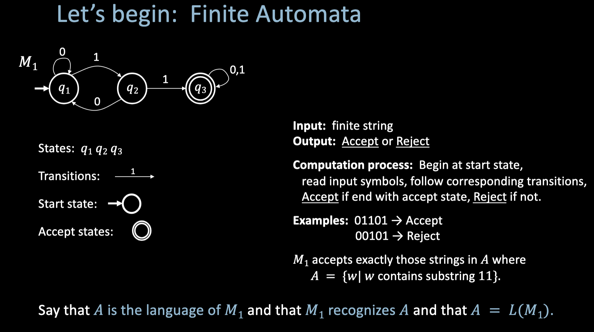

Def: A function
S: ℕ → A
that is surjective is called an enumeration of A.

the cardinality of N < cardilnalit of R

Theorem (Cantor): |ℕ| < |ℝ|
to show this, we jus tneed to show every function fron n to r is not subjective
Surjective (onto): every element of the codomain is hit by at least one element of the domain; f: A → B is surjective iff for every b in B there exists some a in A with f(a) = b.

ohh yeah so that means every thing of n maps to something of ra 
assume f: n -> [0,1] is an enumeration
reading it 
[0,1] is in side of all real numbers
[0,1 ] = {x in R | 0 <= x <= 1}

oh so we assume all of n can map to 0 or 1 possibloy with duplicates

Enumeration of A: a function S: ℕ → A that is surjective—i.e., a way to list (possibly with repeats) every element of A using the natural numbers.

m having trouble with the reasning behidn this

**Proof (sketch):** Assume S: ℕ → [0,1] is an enumeration.

List the values as a table (binary expansion; digits after "0."):

n   | f(n)
----|------------------
1   | 0.10110100100101001...
2   | 0.000000...
3   | 0.1111111111111...  ( = 1? yes: 1/2 + 1/4 + 1/8 + … = 1)
4   | 0.110011000...
5   | 0.10001001...
6   | 0.00010110...

If S really enumerated [0,1], then every real in [0,1] would appear as some f(n).

**Diagonal:** Look at the diagonal digits (1st digit of f(1), 2nd digit of f(2), 3rd digit of f(3), …). Define x by flipping each of those bits: so the nth bit of x is the opposite of the nth bit of f(n).

E.g. x = 0.01001...

Then ∀n ∈ ℕ: the nth bit of x differs from the nth bit of f(n) ⇒ x ≠ f(n). So x is in [0,1] but not in the list. Contradiction. So no enumeration S: ℕ → [0,1] exists ⇒ |ℕ| < |ℝ|.

this proves the interval is bigger than n which measn real numbers is bigger since [0,1] is a subset of r, that means that

** BIG IDEA |n| < |r|. both n and r cardianltiy are infinite but r is more infinite
---

**What does “enumeration” really mean? (simple version)**

An enumeration of a set A is just: **you assign a natural number (1, 2, 3, …) to each element of A**, so that every element gets at least one number. So you’re “listing” A using ℕ. Repeats are allowed (two different numbers can point to the same element).

**Example:** A = {apple, banana, cherry}.  
Define S: ℕ → A by: S(1)=apple, S(2)=banana, S(3)=cherry, S(4)=apple, S(5)=banana, … (repeat forever).  
Then every element of A appears in the list S(1), S(2), S(3), … so S is surjective onto A. That’s an enumeration of A.

**Cantor’s proof in plain words:** We *assume* someone claims they can enumerate [0,1] (list every real between 0 and 1 as f(1), f(2), f(3), …). We then build a number x in [0,1] that’s different from f(1), different from f(2), different from f(3), … so x can’t be anywhere on their list. So the list was never complete—no enumeration of [0,1] exists. So there are “more” reals than naturals.

---

**Cantor’s Theorem (general form)**  
For all sets A, |A| < |𝒫(A)|.

**BIG idea:** DIAGONAL → FLIP → CONTRADICTION.

**Proof.** Assume f: A → 𝒫(A) is a bijection.

- Let D := { x ∈ A | x ∉ f(x) }, i.e. ∀x ∈ A. x ∈ D ⟺ x ∉ f(x).  
  (Diagonal: we look at “x in f(x)?” for each x; D is built by flipping that—x is in D exactly when x is *not* in f(x).)

- Since f is surjective, ∃a ∈ A. f(a) = D.

- Then a ∈ f(a) ⟺ a ∉ f(a). Contradiction. So no such bijection exists ⇒ |A| < |𝒫(A)|.

finite automata

fora this one, you need 2 consecutive ones to be acceptede